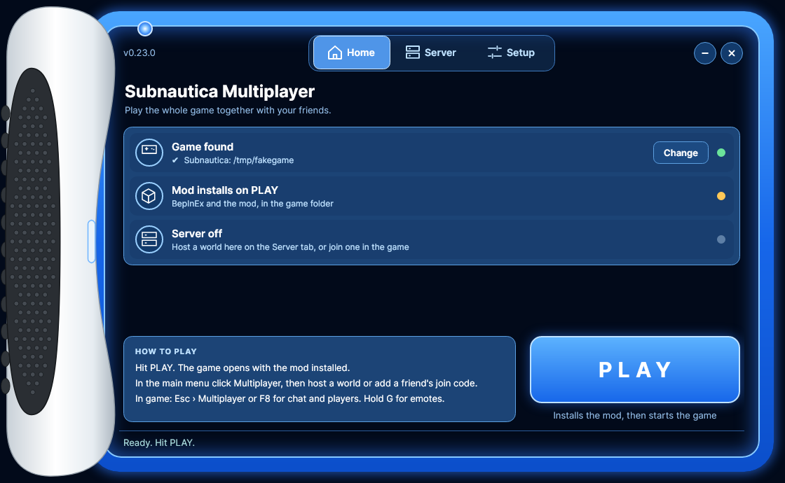

# Subnautica Multiplayer

Co-op mod for Subnautica (the original, BepInEx 5) with a launcher app for Windows and Linux / Steam Deck.

<p align="center"></p>

## What syncs
| Thing | Status |
|---|---|
| Party lobby in the main menu: pick your name + suit color, see who's in, host clicks Start | ✔ |
| Suit colors | ✔ everyone sees your diver in your color |
| Game mode picked in the launcher (Survival / Hardcore / Creative / Freedom) | ✔ |
| Players (position, facing, name tags) | ✔ |
| Chat | ✔ |
| Emotes: 50+ incl. Floss, Default Dance, Take the L, Orange Justice, Electro Shuffle, Griddy, Hype, Robot, Worm, Moonwalk, cartwheels... | ✔ Fortnite-style emote wheel on **G**, everyone sees your diver do it on the same beat (late joiners jump in mid-dance) |
| Dance parties | ✔ everyone who joins dances the same dance at the same moment, with disco lights |
| Pushing | ✔ empty hand + left click on a teammate up close: they get shoved, go limp as a real physics ragdoll, and stand back up after 4 s |
| Titanium Bat | ✔ craft it (4 Titanium, Fabricator > Personal > Tools), click to swing: a teammate in front of you gets launched far the way you look (look up for a home run), ragdolls and gets back up. No damage. Needs Nautilus (the launcher installs it) |
| Blueprints (unlocks, fragment scans) | ✔ everyone shares one tech tree |
| Databank / PDA entries | ✔ |
| Picked-up items + broken outcrops | ✔ gone for everyone |
| Time of day | ✔ server clock |
| Seamoth / Prawn suit / Cyclops | ✔ show up for everyone, whoever drives it moves it |
| Vehicle destroyed | ✔ |
| World saves on the server | ✔ keeps all of the above between sessions |
| Base building (build + deconstruct, furniture inside) | ✔ the builder sends the whole base, saved with the game's own save format |
| Lockers / storage (lifepod, Cyclops, base lockers, planters...) | ✔ full contents re-sent on every change |
| PDA data logs + fragment scan progress | ✔ |
| Teammates on your HUD (beacon-style marker with name + distance) | ✔ |
| Real diver models with swim animations | ✔ |
| Teammate health / food / water under their name | ✔ |
| Item in a teammate's hand | ✔ |
| Dropped / placed items (handing stuff over, beacons) | ✔ |
| Doors and hatches opening / closing | ✔ |
| Deaths: chat message + death beacon | ✔ |
| Vehicle health + battery / Cyclops power | ✔ from whoever drives it |
| Vehicle upgrades, power cells, colors, name, storage | ✔ whole vehicle re-sent when the driver gets out (not Cyclops yet) |
| Docking in moonpool / Cyclops bay | ✔ |
| Cyclops lights, floodlights, silent running, engine speed mode | ✔ |
| Teammates walking inside a moving Cyclops | ✔ positioned relative to the Cyclops |
| Story events (radio messages, Sunbeam, Precursor progress, story PDA) | ✔ every story goal fires for everyone, late joiners catch up |
| Aurora explosion | ✔ one shared timing, so it blows up for everyone at once |
| Your own inventory | ✖ each player keeps their own (like Nitrox) |
| Creatures / fauna AI | ✔ same spawns for everyone, one player runs each creature, attacks hit whoever they chase (new worlds / unexplored areas) |
| Plants / resources in entity slots | ✔ same spawns + same ids, so picking them up syncs |
| Alien containment: fish/eggs you put in, babies and hatchlings | ✔ the host's game breeds, everyone gets the baby |
| Cuddlefish follower, crabsquid EMP | ✖ not yet |
| Player models | ✔ real diver suit, swim animation, held tool |
| Suits: radiation suit, reinforced suit, stillsuit, fins, rebreather, tanks | ✔ you see what they wear |
| Tool animations (knife swing, scanner, builder, welder, PDA...) | ✔ |
| Beds | ✔ the night is skipped only when everyone is in bed together |
| Base power (solar, thermal, bioreactor, nuclear) | ✔ one player runs each generator, everyone's usage comes off the same power |
| Planters | ✔ via locker sync, growth progress kept; fruit picking syncs (wild plants too) |
| Fabricator / crafting animation | ✔ others see it build; only the crafter gets the item |
| Cyclops fires + extinguishing | ✔ the driver's game (or the host) starts fires, everyone sees and can put them out |
| Base / Cyclops leaks and welding | ✔ damage and repairs are shared |
| Build hologram while placing something | ✔ teammates see your green/red ghost |
| Server password, kick, ban | ✔ in the launcher, the in-game F8 window (host) and the dedicated server |
| In-game menus | ✔ made from copies of the game's own menus: the Multiplayer screen is the real Load/New game panels with save-slot rows, in game it's a page in the pause menu (Enter = chat, F8 = open it), chat uses the game's message feed |
| Loading screen when joining | ✔ other players' bases, lockers, items, vehicles and diver models load behind it; your oxygen/food don't drain meanwhile |
| Lag fixes | ✔ network sends never freeze the game, big data is compressed, no more whole-world searches every second |

## In-game Multiplayer menu
Like Nitrox: the main menu gets a **Multiplayer** button next to Play. It lists **your worlds** and **servers you've played on**
(saved with their join codes), lets you **host a world** (name + game mode) straight from the game, and **add a server** by code.
Multiplayer saves are kept out of the normal single-player Load list. The launcher is optional.

## Quick start (players)
1. From the [latest release](../../releases/latest):
   - **Windows**: `SubnauticaMP-vX-Windows.zip`, extract it, run `SubnauticaMP-Launcher.exe`.
   - **Linux / Steam Deck** (any distro): `SubnauticaMP-vX-Linux-x86_64.AppImage`, make it executable
     (`chmod +x` or right-click > Properties > Allow executing) and run it. Subnautica runs in Proton: set its Steam
     launch option once to `WINEDLLOVERRIDES="winhttp=n,b" %command%` (Setup page has a Copy button) so BepInEx loads.
2. **Home**: the chips under the title show whether the game was found and the mod is ready. Not found? Hit
   **FIND GAME** (or Browse). If BepInEx is missing, **Setup > Install BepInEx for me** (or install BepInEx 5 x64
   yourself), start the game once, then close it.
3. **Home**: hit **PLAY**. The game opens on its main menu with the mod installed and up to date.
4. Click **Multiplayer** in the game's main menu:
   - **Host a world**: world name, password (optional), then click a game mode.
   - **Add a server**: your friend's join code (like `KQ7MX-3HD2P`) or IP, a name, and the password if they set one.
   - Server running in the launcher (**Server** page)? It shows up as **Launcher server**: click it to join.
   - **New world**: everyone meets in the **party lobby**: type your name, click to change your suit color,
     and the host clicks **Start the game**. **Existing world**: it loads your save for that world.
5. In game, **Esc > Multiplayer** or **F8** (or the Multiplayer button in the pause menu) opens the multiplayer page: chat, join code, players, kick/ban if you host, leave. **Enter** jumps straight to chat.
6. **Emote wheel**: hold **G**, point at an emote, let go (or tap G and click). **Hold the mouse on a slot** to open the list of
   every emote (with search) and put a different one there. The middle of the wheel shows your diver doing it.
   Click the **middle** to start a **dance party** (or join one): everyone who joins dances together, the dance changes every 16 s.
   In chat: `/e floss`, `/robot`, `/party`... (`/e` lists them). Dances keep going until you swim off, and the camera swings
   behind you so you see it too (`EmoteCamera` in the config turns that off). Key: `EmoteKey` in the config or Options > Mods.

The host is whoever plays on the server's PC (otherwise whoever joined first).
Each player's save for a world is remembered in `BepInEx\plugins\SubnauticaMP\worlds.txt`.

**Autosave:** while playing multiplayer the mod saves your game every 5 minutes with the game's own Save (when the game
allows it: not during the intro or cutscenes). `AutosaveMinutes` in the config changes it (0 = off).

## Optimizer (installed with the mod)
PLAY also installs **Subnautica Optimizer** (`BepInEx/plugins/SubnauticaOptimizer`), a small separate mod with safe speed-ups:
the game's error reporting and analytics off (the error reporter runs on every log message), the game log keeps only
warnings and errors, and smaller garbage-collector steps per frame. `LowInputLagMode` (off by default) queues 1 frame instead of 2: snappier mouse, but can cost FPS. **Performance mode**
(off by default: shorter shadows, nearer LOD switch, optional FPS cap) is in `BepInEx/config/com.subnauticamp.optimizer.cfg`.
The log says which tweaks are on (`Subnautica Optimizer 1.0.0: ...`).

PLAY and Setup > Install BepInEx also download **Nautilus** (the library most Subnautica mods need) into `BepInEx/plugins/Nautilus`.

## Other mods (Nautilus)
Works alongside mods built on [Nautilus](https://github.com/SubnauticaModding/Nautilus) (custom items, creatures, blueprints...):
- When you join, the server checks everyone has the **same content mods as the host** (the host's mods define the world).
  Missing one? You're told which to install. Extra mods are allowed with a heads-up (their stuff won't show for others).
- Nautilus numbers modded items differently on each PC depending on install order. If yours don't match the world,
  the mod **fixes Nautilus's cache for you** (`BepInEx\config\Nautilus\TechTypeCache`, old one kept as `.bak`):
  restart Subnautica without saving and join again.
- With Nautilus installed, the mod's settings (menu key, emote key, suit color, Enter for chat) also show up in **Options > Mods**.
- Chat: `/mods` shows the world's mod list; admins can `/resetmods` so the next player to join sets it.

## Friends on a different wifi
The host's launcher asks the router to open the port automatically (UPnP). The Server tab tells you if it worked.
If it didn't:
- turn on UPnP in the router settings, or
- forward **TCP 11000** to the host PC by hand, or
- everyone installs **Radmin VPN** or **Tailscale** and joins with the host's VPN IP (works even when the ISP uses CGNAT).

## If something breaks
Send `Subnautica\BepInEx\LogOutput.log`. The mod logs which features hooked in
(`Synced features: ...`) and anything it couldn't find in the game (`Game member not found: ...`).

**Lag?** Press **F9** in game for live stats (FPS, frame times, how many ms each part of the mod costs), or type
`/perf` in chat (or Esc > Multiplayer > Lag test) and play normally for 10 s: it writes a report to `LogOutput.log`
that says whether each stutter came from the mod, from garbage collection, or from the game itself (terrain/world
streaming while you turn the camera). Send that log. `Performance = false` in the config turns the speed tweaks off.
Every minute the game log also gets a `[lag] last minute:` line (FPS, stutters, and network: whose game froze vs
whose updates arrived late), and the host's launcher writes `server.log` (in `%AppData%\SubnauticaMP`) with a
`[lag]` line per minute showing whether the server PC was too busy to send in time. Send both logs.

**Game closes by itself on the loading screen** and the log ends with `Couldn't initialize Steamworks`?
That's the Steam version quitting because Steam wasn't running. Open Steam first (the launcher's PLAY
now does that for you).

**Game opens, closes, then opens again without the mod?** Steam took over and started *its* copy of the game.
Update the launcher and use its PLAY button: it now keeps the game in the folder the mod is in (writes
`steam_appid.txt`, opens Steam first), and tells you if Steam's own copy is somewhere else.

## Dedicated server
```
dotnet run --project src/SubnauticaMP.Server -- 11000 world.dat --password secret
```
Options: `--autosave <minutes>` (default 2), `--backups <count>` (default 10, kept in `backups\<world>\`).
Commands: `players`, `kick <name>`, `ban <name>`, `unban <name>`, `bans`, `save`, `quit`.

On start the server prints the world, port, password, **admin password**, autosave and backup settings (like Nitrox).
In game, anyone can type `/login <admin password>` in chat to become an admin, then `/help`:
`/players`, `/kick`, `/ban`, `/unban`, `/bans`, `/save`, `/backup`. The host is always an admin.

## Building
Needs the .NET 8 SDK.
```
dotnet test                                                   # 37 tests: networking, world sync, lobby, UPnP, launcher UI
dotnet publish src/SubnauticaMP.Launcher -c Release -r win-x64   # -> SubnauticaMP-Launcher.exe (mod packed inside)
dotnet build src/SubnauticaMP.Plugin -c Release -p:GameDir="C:\...\Subnautica"   # mod only, copies into the game
```
The mod finds Subnautica's code by name at runtime, so it builds without the game.
Without `GameDir` it compiles against `lib/BepInEx.Ref` (a compile-only copy of the BepInEx API) and public Unity/HarmonyX packages.

## Layout
| Folder | What |
|---|---|
| `src/SubnauticaMP.Shared` | Protocol, server (world state + saving), client, UPnP, join codes |
| `src/SubnauticaMP.Plugin` | The BepInEx mod: sync systems, Harmony hooks, F8 window |
| `src/SubnauticaMP.Launcher` | Windows launcher app (Avalonia) |
| `src/SubnauticaMP.Server` | Dedicated server console app |
| `lib/BepInEx.Ref` | Compile-only BepInEx API |
| `tests/` | Networking/sync tests + launcher UI tests |

## Credits
Dance and emote motions come from the [CMU Graphics Lab Motion Capture Database](http://mocap.cs.cmu.edu)
(BVH conversion by Bruce Hahne / cgspeed), free for any use. The database was created with funding from NSF EIA-0196217.
The Titanium Bat model is by Gabriel (`tools/bat/`, `make_bat.py` makes the in-game copy and icon, `preview_swing.py` previews the swing).
Floss, Worm, Default Dance, Take the L, Orange Justice, Electro Shuffle, Griddy and Hype are hand-made lookalikes (no game files from Fortnite). `tools/emotes/make_emotes.py` rebuilds the animation file.
